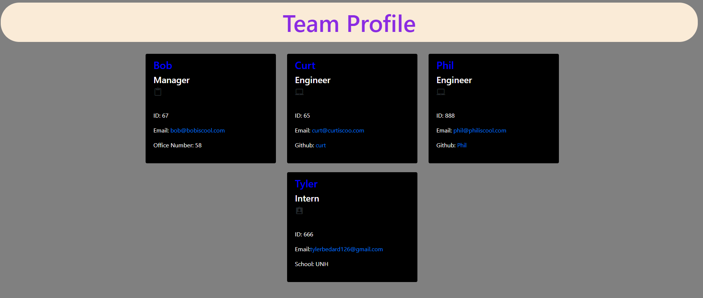

# Team Profile Generator
  

            
## Table of Contents:
1. [Description](#description)
2. [Installation](#installation)
3. [Usage](#usage)
4. [Contributing](#contributing)
5. [Tests](#tests)
6. [Questions](#questions)
7. [License](#license)

## Description:
This application is made for you to create a team page with all of your employees and what role they are!          

## Installation:
To install this application you will need to clone the github repo and open it up on your local machine. Once it is open on your machine open the file up in the terminal and type npm i then hit enter. This will give you all the dependancies you need to run this program. After that type node index.js to run the application and just fill out the questions!  When you are done it will generate the HTML page for y ou!
            

 Here is a link to the video on how to use the application [Link](https://drive.google.com/file/d/17MV_GnO4AKNwm2Y57LGF-3MuIEwlEZoR/view)

## Usage:
You use this application to help you keep better track of your team of employees.
            
## Contributing:
This was a solo project.
            
## Tests:
N/A
    
## Questions:
Email: tylerbedard126@gmail.com

GitHub: 
[tbedard126](https://github.com/tbedard126)

Email
## License:

  MIT
  
  
  